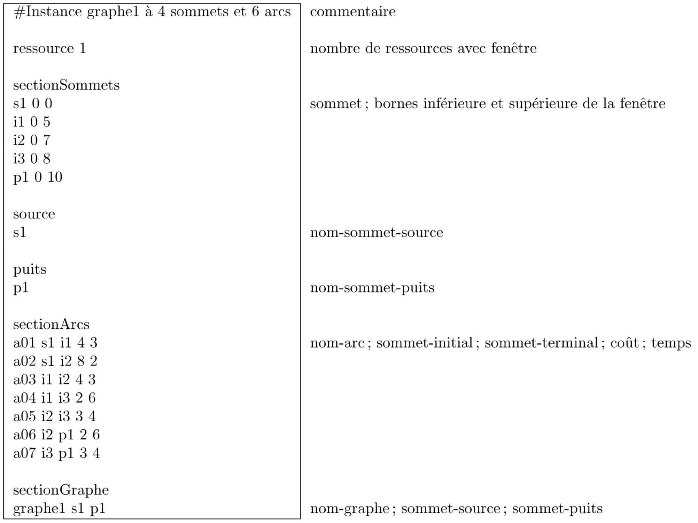
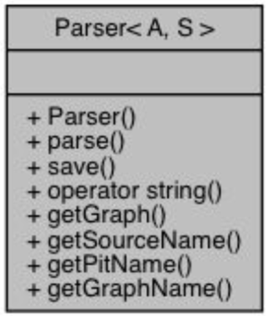
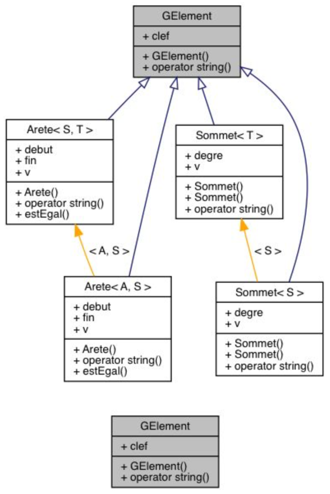
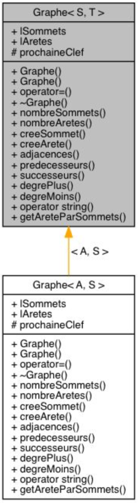
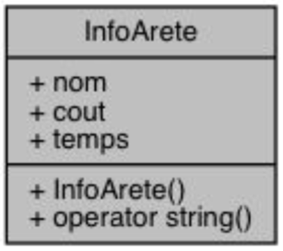
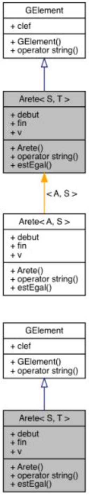
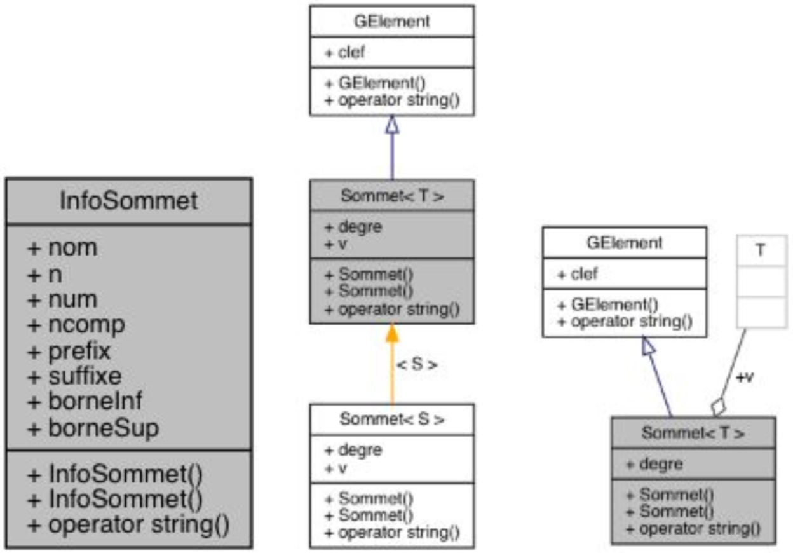
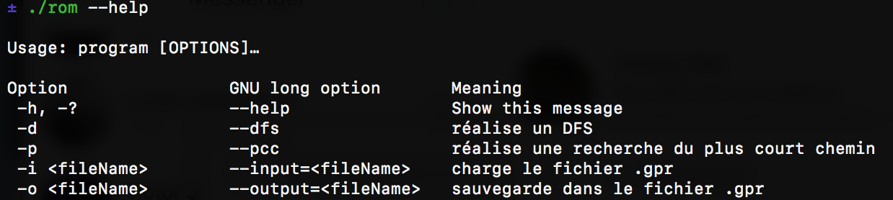
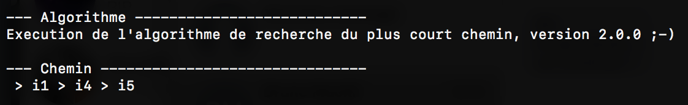

# Rapport

## Sujet :

L’objectif de ce projet est la réalisation d’une application C++ permettant de tester et d’illustrer un ensemble de propriété dans un graphe.
Le travail principal est l'implémentation des algorithmes de graphes vu en cours. Les propriétés implémentés sont :
- Le parcours DFS
- L’algorithme du plus court chemin
- Création du graphe retour
Les graphes sont définis dans un fichier avec l'extension *.gpr*, regroupant les informations nécessaires.

## Réalisation :

En premier lieu une classe `Parser` a été réalisé afin d’extraire les informations nécessaires à la réalisation du projet du fichier *.gpr* (informations sur les arêtes, sur les sommets, les coûts, les puits, etc...). Cette classe permet de charger et de sauvegarder un fichier texte au format gpr, en proposant des méthodes `parse` et `save`

Une classe `GElement` représente la classe de base des éléments d'un graphe qui peuvent être des sommets ou des arêtes. Il permet de définir les clefs des éléments du graphe.

La classe `Graphe` permet la construction d’un graphe générique vide. On y ajoute ensuite les sommets, puis les arêtes reliants ces sommets.

Une classe `InfoArete` permet de stocker le coût d’une arête spécifique.

Une classe `Arete` représente une arête de manière générale. Elle est définie par un sommet de début, un sommet de `fin` et une information `v`.

Le procédé est le même pour les classes `Sommet` et `InfoSommet` permettant respectivement de stocker l’information générale d’un sommet, et de stocker les informations d’un sommet spécifique.

L’utilisation des classes Template permet la généricité du code et par conséquent une adaptation et une évolution plus simple, notamment pour l’implémentation des algorithmes de parcours du graphe.

## Utilisation

## Structure de données

La structure de données est la suivante :

- Un graphe générique
- Composé d’arêtes et de sommets généraux
- Les sommets sont pris individuellement pour gérer leurs
particularités
- Les arêtes sont prises individuellement pour gérer leurs
particularités comme le coût et les sommets qu’elle relie.

## Tests et résultats :

Pour les tests ce sont les fichiers *.gpr* données avec le sujet qui seront utilisés.
Les résultats sont retournés dans un nouveau fichier *.gpr*.
A l'exception du PCC où l’on peut aussi afficher le graphe textuellement.

